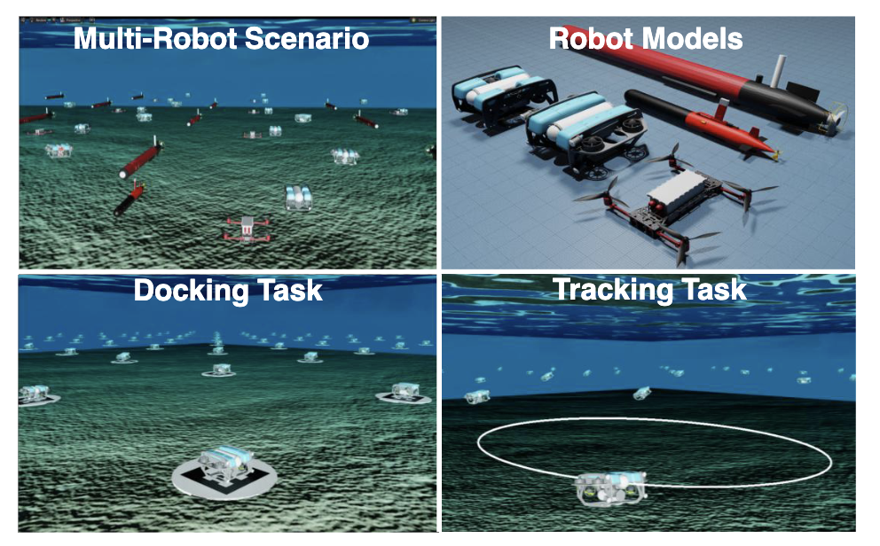

---

# MarineGym

[](https://docs.isaacsim.omniverse.nvidia.com/4.2.0/archived_release_notes.html)
[](https://docs.python.org/3/whatsnew/3.7.html)
[](https://marinegym.netlify.app/)
[](https://marine-gym.com/)
[](https://opensource.org/licenses/MIT)

*MarineGym* is a large-scale parallel framework designed for reinforcement learning research on unmanned underwater vehicles (UUVs). It is built upon [OmniDrones](https://github.com/btx0424/OmniDrones) and [Isaac Sim](https://developer.nvidia.com/isaac/sim), offering the following features:

- Efficiency: Achieve a simulation speed of up to 10<sup>7</sup> steps per second.
- Fidelity: Accurately replicate the physical environment, including physical laws, kinematics, and dynamics.
- Flexibility:  Ensure compatibility with existing RL frameworks and offer user-friendly APIs to facilitate seamless integration and usage.
- Evaluation: Assesses and contrasts various RL strategies through multiple tasks.

## Installation

To install MarineGym, we recommend reading one of the following guides:
- [Installation from Source](https://marinegym.netlify.app/installation_from_source) (recommended for development)
- [Docker Environment](https://marinegym.netlify.app/docker_environment) (recommended for training purposes; no visualization interface)

If you encounter any issues, you can find solutions to common problems in the [FAQ](https://marinegym.netlify.app/faq) or feel free to open an issue.

For training and evaluation commands, please take a look at the [Quick Start](https://marinegym.netlify.app/quick_start).

## Usage
For installation details, please refer to our [Setup Guide](https://marinegym.netlify.app/installation_from_source/).

Currently, five gym environments are verified: Hover, Circle Tracking, Helical Tracking, Lemniscate Tracking, and Landing. Additional environments, including vision-based and sonar-based tasks, are under development.

The training script is located in the `scripts` folder, named `train.py`.


To start the training process, run:

```bash
python train.py task=Hover algo=ppo headless=false enable_livestream=false
```
where `task` specifies the training scenario, which can be `Hover`, `Track`, or `Landing`.

### PathFollow (PPO)

`PathFollow` 태스크는 각 env마다 랜덤 3D loop path를 생성하고, thruster(로터) 커맨드로 경로 추종을 학습합니다.

```bash
python scripts/train.py task=PathFollow algo=ppo headless=true enable_livestream=false
```

GUI로 확인할 때는 env 수를 줄여서 실행하세요:

```bash
python scripts/train.py task=PathFollow algo=ppo env.num_envs=1 headless=false enable_livestream=false max_iters=50 total_frames=200000
```

## Troubleshooting

### Livestream starts but reports capture device initialization errors
If you see log lines like `Stream Server: Net Stream Creation failed` or
`Couldn't initialize the capture device`, the WebRTC server started but could not
open a rendering capture device. This typically points to a missing or
misconfigured GPU/Vulkan stack inside the container or VM, so validate that
Vulkan can enumerate the NVIDIA GPU and that the driver libraries are visible
inside the container before retrying livestream.  

### ImportError: `DiscreteTensorSpec` missing from `torchrl.data`
Isaac Sim ships with a TorchRL build that can differ from upstream. If you see
`ImportError: cannot import name 'DiscreteTensorSpec' from 'torchrl.data'`,
use the compatibility shim in `marinegym.utils.torchrl.specs` (and update any
direct imports) so the project can fall back to the spec implementation bundled
with TorchRL.  


## Citation

If you build on this work, please cite our paper:

```bibtex
@online{chu_2025_MarineGymHighPerformanceReinforcement,
        title = {MarineGym: A High-Performance Reinforcement Learning Platform for Underwater Robotics},
        shorttitle = {MarineGym},
        author = {Chu, Shuguang and Huang, Zebin and Li, Yutong and Lin, Mingwei and Carlucho, Ignacio and Petillot, Yvan R. and Yang, Canjun},
        date = {2025-03-12},
        eprint = {2503.09203},
        eprinttype = {arXiv},
        eprintclass = {cs},
        doi = {10.48550/arXiv.2503.09203},
        pubstate = {prepublished}
        }
```

## Acknowledgement

The architecture and certain implementation ideas build upon concepts introduced in [OmniDrones](https://github.com/btx0424/OmniDrones).
